# 
A weakly supervised inpainting-based learning method for lung CT image segmentation

## Abstract
Recently, various fully supervised learning methods are successfully applied for lung CT image segmentation. However, pixel-wise annotations are extremely expert-demanding and labor-intensive, but the performance of unsupervised learning methods are failed to meet the demands of practical applications. To achieve a reasonable trade-off between the performance and label dependency, a novel weakly supervised inpaintingbased learning method is introduced, in which only bounding box labels are required for accurate segmentation. Specifically, lesion regions are first detected by an object detection network, then we crop them out of the input image and recover the missing holes to normal regions using a progressive CT inpainting network (PCIN). Finally, a post-processing method is designed to get the accurate segmentation mask from the difference image of input and recovered images. In addition, real information (i.e., number, location and size) of the bounding boxes of lesions from the dataset guides us to make the training dataset for PCIN. We apply a multi-scale supervised strategy to train PCIN for a progressive and stable inpainting. Moreover, to remove the visual artifacts resulted from the invalid features of missing holes, an initial patch generation network (IPGN) is proposed for holes initialization with generated pseudo healthy image patches. Experiments on the public COVID-19 dataset demonstrate that PCIN is outstanding in lung CT images inpainting, and the performance of our proposed weakly supervised method is comparable to fully supervised methods.
## 1.Introduction
According to the latest statistics from the Center for Systems Science and Engineering (CSSE) of Johns Hopkins University (JHU) (updated March 10, 2023), confirmed cases of COVID-19 in the world have reached 676.6 million, including 6.88 million deaths. Recently, with the wide spread of Omicron mutant in the world, the epidemic has rebounded in many countries and newly confirmed cases per day have reached a new high.
Although real-time reverse transcription-polymerase chain reaction (RT-PCR) is considered the diagnostic benchmark for COVID-19, it suffers from many limitation such as short in supply, high false-negative rates and higher cost equipment [[1](#b0)]. Chest computed tomography (CT) images of COVID-19 patients have unique characteristics, which show multiple small patchy shadows and interstitial changes, mainly in the peripheral lungs at the early stage and then multiple groundglass opaque (GGO) infiltrates in both lungs [[2](#b1)]. Clinical practice has of these methods is considered directly proportional to the scale and accuracy of the required dataset. It should be noted that annotation of pixel-level labels is a labor-intensive process and suffers from a high cost and uneven quality. Although the unsupervised learning methods are label-free, their performance fail to meet the demands of practical applications. Semi-supervised and weakly supervised methods are able to achieve a trade-off between the performance and label dependency, however, few related researches exist.
Weakly supervised learning methods for semantic segmentation, can be divided into image-level label-based, bounding box label-based, scribble label-based and points label-based according to the way of annotation. Image-level labels only provide the category of an image, so image-level label-based methods first train a classification model, then employ Class Activation Maps (CAM) [[6](#b5)] technology to obtain the most responsive regions from the model as seed regions, finally perform a series of expansion methods to obtain the segmentation mask. Because CAM are unable to cover the entire target, it requires a high performance of the post-processing steps to ensure final segmentation. The bounding boxes are the representations of objects position, so bounding box label-based methods treat it as a strong topological prior, then combine traditional image algorithm GrabCut [[7](#b6)] or its improved trainable version DeepCut [[8](#b7)]. Scribble labels refer to marking the target with scribble lines to get the rough location information. Scribble labelbased methods [[[9](#b8)],[[10](#b9)]] are extension of DeepCut, which incorporate deep features in constructing the unary part of the loss function. Points labels indicate the object location using single or few pixels. Points label-based method [[11](#b10)] is prone to local minima, e.g., focusing on only a small part of the target. Therefore, objectness prior is included in the training loss function to accurately infer the object extent. These four methods have achieved passable results on public datasets such as MS COCO and PASCAL VOC. All other weakly label-based methods except bounding box label-based methods have been applied for COVID-19 lesion segmentation.
To reduce the dependence on pixel-level labels, in this paper, we explore a novel weakly supervised inpainting-based learning method for COVID-19 lesion segmentation, in which only bounding box labels are required for training. Different from the general practice, our proposed method consists of three stages: detection, inpainting and segmentation. In the first stage, the bounding boxes of lesions are detected by the state-of-the-art object detection network Faster RCNN [[12](#b11)]. In the second stage, we crop the detected lesion regions out of the image and recover the missing holes to normal regions using image inpainting technology. In the third stage, the segmentation mask is obtained from the difference image between the input and recovered images through a series of post-processing operations 1 We did not overlay the results with the region of no missing to comprehensively demonstrate our inpainting effect. including median filtering, binarization, dilation and region growing. For a better image inpainting, our proposed progressive CT inpainting network (PCIN) decouples the recovery of high-frequency and lowfrequency information. As shown in Fig. [1](#fig_0), PCIN first recovers the missing skeleton (Fig. [1](#fig_0)(b)) using structure inpainting branch, and then utilizes the comprehensive inpainting branch for a reasonable complete result (Fig. [1](#fig_0)(c)) generation. To solve the issue that invalid features of the holes lead to color discrepancy and blurriness, we propose an initial patch generation network (IPGN) to generate pseudo healthy image patches for holes initialization. In addition, we supervise the recovery effect at multiple scales during training period for a progressive and stable inpainting.
Our contributions are summarized as follows:
1. We propose a weakly supervised inpainting-based learning method for COVID-19 lesion segmentation from lung CT images, in which only bounding box labels are required and three stages: detection, inpainting and segmentation are included. 2. A progressive CT inpainting network (PCIN) is proposed to recover lung CT images with rectangle missing holes, which first uses structure inpainting branch to recover the skeleton, and then fuses deep structure features to comprehensive inpainting branch for a reasonable complete result generation. 3. A multi-scale supervised strategy is applied to train PCIN for a progressive and stable inpainting. In addition, to remove the visual artifacts resulted from the invalid features of missing holes, an initial patch generation network (IPGN) is proposed to generate pseudo healthy image patches for holes initialization. 4. Experiments on public COVID-19 dataset demonstrate that PCIN is outstanding in CT images inpainting, and the performance of our proposed weakly supervised method is comparable to fully supervised methods.

## 2.Related works
In this section, we briefly review deep learning-based methods for COVID-19 lesion segmentation and image inpainting.

### 2.1.Deep learning-based methods for COVID-19 lesion segmentation

#### 2.1.1.Fully supervised learning methods
UNet [[13](#b12)] is generally acknowledged as a fully supervised standard backbone network for medical image segmentation. UNet and its improvement networks (UNet++ [[14](#b13)], VNet [[15](#b14)], etc.) or UNetlike networks are also widely used for COVID-19 lesion segmentation because of their excellent performance. Cao et al. [[3](#b2)] used original UNet to segment the COVID-19 lesion from CT images. Jin et al. [[5](#b4)] used UNet++ for lesion segmentation. To improve the segmentation performance, Yan et al. [[16](#b15)] combined the Atrous Spatial Pyramid Pooling (ASPP) module to UNet to increase the receptive fields of network as well as improve the ability of multi-scale contexts acquirement. Fully supervised methods work well but rely on large-scale accurate pixel-level label datasets, whereas only small-scale datasets are available for researchers. To achieve comparable performance, multi-input and multi-scale inputs are used to adequately extract image features and perform feature fusion. In addition, researches on improving the loss function are also presented. Wang et al. [[17](#b16)] proposed a noise robust Dice loss function, which solves the problem of poor training performance with low quality and high noise labels. To address the overfitting caused by millions of model parameters, Anam-Net [[18](#b17)] and MiniSeg [[19](#b18)] are proposed, which also promote the deployment of models on embedded devices.

#### 2.1.2.Weakly supervised learning methods
Statistics [[11](#b10)] show that making the accurate pixel-level segmentation labels is so labor-intensive that it takes 239.0 s per image on average for the PASCAL VOC dataset, whereas collecting image-level and point-level labels takes only 20.0 and 22.1 s per image. Hence, different forms of weaker labels are applied for lesion segmentation, including image-level, bounding boxes-level, scribble-level and pointlevel annotations. Wang et al. [[20](#b19)] first inferred some candidate lesion regions as seeds from classification model trained from image-level labels by applying CAM method, then performed a series of expansion methods to obtain the segmentation mask. However, CAM only focuses on the most discernible regions but not covers the entire target, which requires a high performance of the post-processing algorithm to ensure the segmentation result. Liu [[21](#b20)] trained a COVID-19 lesion segmentation model using scribble-level labels. To deal with the difficulty caused by the shortage of supervision, he incorporated uncertainty-aware selfensembling and transformation-consistent techniques. Point-level labels contain little supervised information and thus are most difficult to be exploit. To resolve the low precision of the model, Laradji et al. [[22](#b21)] proposed a consistency-based loss function that encourages the output predictions to be consistent with spatial transformations of the input CT images. To the best of our knowledge, we firstly propose a weakly supervised learning method for COVID-19 lesion segmentation using bounding boxes-level labels.

#### 2.1.3.Semi-supervised learning methods
The missing Labels of some images in the dataset result that networks fail to calculate their losses in training period, so semi-supervised methods focus on how to get the unlabeled image into training. Currently, two types of solutions have been proposed to solve this problem, including consistent regularization and self-training using pseudo labels. The first type of solutions follows the assumption that the inputs under different perturbations would be predicted the same result. Thus, we are able to apply perturbations like noise, rotation and scaling to input CT images, or apply perturbations like dropout to networks, then encourage networks to be transformation consistent for unlabeled images. Ding et al. [[23](#b22)] applied this strategy to COVID-19 lesion segmentation. The second type of solutions first obtains the pseudo labels for unlabeled CT images from the model trained from labeled CT images. Pseudo labels are then used to supervise the unlabeled CT images in training period. Training dataset are gradually enlarged by unlabeled images with reliable pseudo labels. Meanwhile, the model results and pseudo labels gradually become more accurate. Fan et al. [[24](#b23)] applied this strategy for COVID-19 lesion segmentation.

#### 2.1.4.Unsupervised learning methods
Unsupervised methods are currently popular, which completely abandon the label dependency although their performance is far inferior to fully supervised methods. Zheng et al. [[4](#b3)] performed segmentation on blood vessels and inpainting blood vessels to normal tissue, then segmented the lesion using representation learning and clustering [[25](#b24)]. Average NMI score of this method is 0.394 but it is so time-consuming that segmenting one CT case needs over three hours. Some methods [[[26](#b25)],[[27](#b26)]] applied auto-encoder to learn latent feature from CT images with lesion, and then recovered the images to health, finally obtained the segmentation results by post-processing the images before and after recover. Inspired by these works, we propose a two-branch auto-encoder network, i.e., PCIN for CT image inpainting.

### 2.2.Image inpainting
Image inpainting, a technology used to fill in missing regions with plausible alternative contents, is widely used in repairing mask with different shape, target removal, denoising, removing watermark and coloring of old photos [[28](#b28)]. Image inpainting methods can be grouped into traditional methods and learning-based methods. Traditional patchbased methods [[[29](#b29)],[[30](#b30)]] fill large holes by searching for the most relevant patches from the complete part of a group of images. Traditional diffusion-based method [[31](#b31)] smoothly propagates information from the boundary of the missing holes to the interior with variational algorithms. Traditional methods are able to solve the inpainting task with small area, simple structure and texture of the missing region. However, for more complex image inpainting task, learning-based methods have more advantages because of their understanding and perception of high-level semantic information of images. Learning-based methods use generative models such as VAE [[32](#b32)] and GAN [[33](#b33)] for inpainting. Context encoder [[34](#b34)] is the first work to combined auto-encoder network with adversarial training for image inpainting. It generates complete image from semantic features extracted from auto-encoder network and supervises with the pixel-wise reconstruction loss and adversarial loss. The introduction of reconstruction loss makes the inpainting result more realistic but has problems with boundary distortion and local blurring. To solve this problem, Iizuka et al. [[35](#b35)] added a global discriminator that performed on the whole image region to work with the local discriminator. Local and global structural semantic information drives boundaries of recovered holes to be more continuous.
In addition, many meaningful improvements have emerged. To address that invalid features of missing holes produce artifacts such as color difference and blur when standard convolution networks are used for image inpainting, Liu et al. [[36](#b36)] proposed Partial Convolution and Yu et al. [[37](#b37)] proposed Gate Convolution. Zeng et al. [[38](#b38)] proposed a pyramid-context encoder to improve the visual and semantic plausibility of inpainting results. In order to improve the inpainting effect on images with large holes, Li et al. [[39](#b39)] proposed a Progressive Reconstruction of Visual Structure (PRVS) network that progressively reconstructs the structures and the associated visual feature, in which a novel Visual Structure Reconstruction (VSR) layer is proposed to entangle reconstructions of the visual structure and visual feature. Nazeri et al. [[40](#b40)] proposed EdgeConnect, which imitates sketch art and divides inpainting process into a two-stages: edge generation and image completion. Predicted edge maps from the first stage are passed to the second stage to guide the inpainting process. This method has ability to deal with images with multiple, irregularly shaped missing regions.
In the field of medical image, inspired by EdgeConnect, Wang et al. [[41](#b41)] proposed a model based on edge and structure information for CT images inpainting, which utilizes both edge and structure images as priors of the ground truth. It achieves the best performance on several public CT datasets. Inspired from EdgeConnect and PRVS, we used structure (skeleton) information as a prior of ground truth and apply a progressive multiscale strategy to train our proposed CT inpainting network.

## 3.Method
This section first gives the overall workflow of our proposed weakly supervised inpainting-based learning method, then introduces the detection network, next details the structure extraction module (SEM), initial patch generation network (IPGN) and progressive CT inpainting network (PCIN) for inpainting, finally demonstrates the post-processing method for segmentation. 

### 3.1.Overall workflow
The workflow of training our proposed weakly supervised learning method is shown in Fig. [2](#fig_1)  with pseudo healthy image patches 𝑓 𝑖𝑝𝑔𝑛 (𝑧) generated from IPGN, and then its contour and structure information are extracted by SEM and feed into PCIN to get recovered healthy image. Third, the segmentation mask is obtained from the difference image between the input and recovered images using a post-processing algorithm.

### 3.2.Detection
In the first stage of the proposed method, the bounding boxes of lesions are detected by the state-of-the-art object detection network Faster RCNN. Faster RCNN [[42](#b42)] consists of three main modules: extractor, region proposal network(RPN) and classifier. VGG-16 model with a pre-trained weights from ImageNet is used as a deep features extractor. The obtained feature maps are shared with subsequent modules. RPN is a major innovation of Faster RCNN, it is used to replace the extremely time-consuming selective search algorithm in Fast RCNN to generate region proposals. Specifically, a sliding window (3x3 convolution layer) slides over the shared feature maps to get intermediate feature maps, F. Lu et al. in which each point is the deep low-dimensional information mapped from the anchor boxes with different sizes and ratios on the input CT image. Then, a 1x1 convolution layer judges whether anchor contains objects and another 1x1 convolution layer predicts the position of anchors. Next, these rough region proposals are mapped back to shared feature maps and cropped out to get a proposal feature maps. Finally, in the classifier, RoI pooling resizes the proposal feature maps to the same size and feeds them into several full connect layers to get the final anchors location and class. In this work, we used a total of 9 anchors including three different scales and aspect ratios for each point based on the distribution of lesion size in our dataset. Table [1](#tab_0) shows the initial setting of anchors, where base size is the datum scale of the anchor size. Let 𝑏 denotes base size, 𝑠 and 𝑟 are certain scale and aspect ratio respectively, thus the anchor size can be calculated as follow:

$$
h e i g h t=b*s*\sqrt{r}
$$
$$
w i d t h=b*s*\sqrt{1/r}

\tag{2}
$$
In this work, we follow the multi-task loss to minimize the objective function, as defined in original Faster RCNN. The total loss  𝑑𝑒𝑡 can be divided into two parts: loss of RPN and loss of classifier. We denote it as:

$$
\tilde{\cal L}_{d e t}=\tilde{\cal L}_{r p n}+\tilde{\cal L}_{c l a s s i f i e r}

\tag{3}
$$
where  𝑟𝑝𝑛 and  𝑐𝑙𝑎𝑠𝑠𝑖𝑓 𝑖𝑒𝑟 are the same defined as Faster RCNN.

### 3.3.Holes generation algorithm
Generating holes similar to the ground truth for training has two advantages: ([[1](#b0)]) it is able to improve the generalization ability of the model. ( 2) it is able to facilitate the application of our proposed inpainting method on datasets with different distribution of lesion. Therefore, the statistics information of the lesion guides us to make the training set  𝑠 for the inpainting network.
Given 472 healthy CT images in  𝑛 , we first duplicate them and generate one hole for each CT image, resulting in a set  1 472 , where subscript represents the total number of images and superscript represents the number of lesion in each image. Next, we calculate the proportion that number of images with two lesions accounted for that of one lesion is about 0.56(according to Fig. [10](#fig_9)(a 
$$
D_{s}=\{{\mathcal N}_{472}^{1},{\mathcal N}_{264}^{2},{\mathcal N}_{282}^{3},{\mathcal N}_{215}^{4},{\mathcal N}_{113}^{5}\}_{f_{t y s}}
$$
Considering inpainting task is not sensitive to the aspect ratio of missing regions, the generated holes are squares. The lengths of these square holes are randomly selected from {25, 50, 75, 100, 150, 250} according to Fig. [10](#fig_9)(b). Moreover, holes are not exceed the minimum boundary rectangle of lungs. Some examples of holes generation algorithm are visualized in Fig. 3.

### 3.4.Inpainting

#### 3.4.1.Structure extraction module (SEM)
As shown in Fig. [2](#fig_1), SEM extracts the structure and contour information from an input CT image  (𝑖)  𝑠 and feeds them into structural inpainting branch of PCIN. As illustrated in Fig. 4, SEM is composed of a series of image processing steps. First, a median filter with kernel size 7 × 7 is applied to smooth the images and further reduce noise, which is mainly tiny blood vessel tissue. Second, skeleton in the CT image is automatic segmented by OTSU [[43](#b43)] method. Third, we extract all the connected regions using an algorithm based on topological structural analysis [[44](#b44)] (provided by opencv). Forth, we select the maximum connected region and obtain the final structure information including structure and contour by filling and stroking. It is noted that missing holes of the image are filled with a pixel value of 0 during extraction process.

#### 3.4.2.Initial patch generation network (IPGN)
Standard convolution indiscriminately treats all pixels including missing holes as valid pixels that imply semantic information, which has been experimentally shown to result visual artifacts, color differences, etc. Initializing a fixed pixel value for the missing holes has limited improvements. Two effective methods, Partial Convolution and Gate Convolution, take the additional maintenance of a mask to filter out invalid content for standard convolutions. However, as the network deepens, this ability to discriminate whether a pixel is valid or invalid gradually decreases. In this work, IPGN is proposed to generate pseudo healthy image patches to initialize the missing holes. This method reduces the invalidity of pixels in the missing holes and does not increase the burden of inpainting network. As illustrated in Fig. [6](#fig_5), IPGN uses a 2D random noise of 25 × 25 as input to generate a fake image of 100 × 100. Three types of convolution block are designed for IPGN and the details of PCIN are shown in Fig. [5](#fig_4). Instance normalization (IN) in CB-A and CB-B can accelerate model convergence and promote style consistency between generated images and real images, so six CB-A are used for feature extraction. Two transposed convolution layers instead of up-sampling layers are used to expand the image size because it works well in image reconstruction from reduced representations, i.e. noise. In order to generate more realistic images, we construct a discriminator to train IPGN utilizing an adversarial loss base on GAN. The discriminator uses one CB-A and five CB-B for feature extraction. Five max pooling layers gradually increase the receptive field of the network while decreasing the size of feature maps. Finally, the classification result is given by the fully connected layer.
In conclusion, IPGN serves as a generator to learn the data distribution from a random noise, and a discriminator learns to distinguish between the fake output and the real image, hence the adversarial loss for IPGN,  𝑖𝑝𝑔𝑛 , is:

$$
\mathbb{Z}_{i p g n}=\operatorname*{min}_{f_{i p g n}}\operatorname*{max}_{D}\mathbb{E}_{x\sim X}[I o g(D(x))]
$$
$$
+\Xi_{z\sim\bar{z}}[l o g(1-D(f_{i p g n}(z)))]

\tag{5}
$$
where 𝐷 represents discriminator,  and  represent distribution of real images  𝑔 and noise 𝑧, respectively. Some fake images generated by IPGN are shown in Fig. [7](#fig_6), we observe that the lung parenchyma is realistic but the skeleton is easily distinguished as fake by human eyes. Deformed and disordered skeleton will be further recovered by our proposed inpainting network.

#### 3.4.3.Progressive CT inpainting network (PCIN)
Considering that recovery of skeleton in the missing holes is critical for subsequent segmentation, a separate branch is designed in PCIN to recover skeleton. To our best knowledge, EdgeConnect [[40](#b40)] first divided the image inpainting process into a two-stages: edge generation and image completion, in which edge generation is solely focused on edges of the missing holes. EdgeConnect enlightens from how artists work, i.e., ''lines first, color next''. However, this method is not applicable to chest CT images that with simple edge information. On this basis, Wang et al. [[41](#b41)] utilized both edge and structure images as priors of the ground truth for CT images inpainting. However, this structural information retains pulmonary parenchymal features, but results in poor skeleton recovery in his results. To address this problem, we extract pure structure (i.e. skeleton) and contour information from the input CT image using SEM, and then decouple the recovery of skeleton from the overall recovery through a single network which called structure inpainting branch. As shown in Fig. [8](#fig_7), PCIN fuses the deep structure features with different scales from structure inpainting  𝑠 initialize by IPGN as input, its corresponding label is  (𝑖) 𝑛 , we extract the ground truth structure image  𝑆(𝑖) 𝑛 from it using SEM, the loss function is given by:

$$\theta_{p c i n}=\theta_{p c i n}^{S}+\theta_{p c i n}^{C}
\tag{6}
$$

$$
{\mathcal{L}}_{p c i n}^{S}=\sum_{i=1}^{S}L_{s t e p}(f_{p c i n}^{S(i)},f_{r e s i z e}^{S-i}(T_{n}^{S(i)}))

\tag{7}
$$

$$
{\bar{h}}_{p\mathrm{e}i n}^{C}=\sum_{i=1}^{5}{\cal L}_{s l e p}(f_{p\mathrm{e}i n}^{C(i)},f_{r\mathrm{e}i|i z e}^{\int_{\mathrm{e}}}({\cal L}_{n}^{(i)}))

\tag{8}
$$
where 𝑓 𝑡 𝑟𝑒𝑠𝑖𝑧𝑒 is a function used to downsample an image 𝑡 times with a 2 × 2 stride. 𝐿 𝑠𝑡𝑒𝑝 is a binary cross entropy loss function.
Details of training process are given in Algorithm 1 (see Appendix). In summary, the total loss function of our proposed weakly supervised  inpainting-based learning method,  𝑡𝑜𝑡𝑎𝑙 is
$$
\mathbb{Z}_{t o t a l}=\mathbb{Z}_{d e t}+\mathbb{Z}_{i p g n}+\mathbb{Z}_{p c i n}
$$

### 3.5.Segmentation
As shown in Fig. [9](#fig_8), the segmentation stage obtains the lesion mask using blood vessels removal, image difference and a series of post-processing steps. Specifically, Given a CT image  𝑖𝑛 with lesion bounding boxes detected in the first stage and its inpainting result  𝑜𝑢𝑡 outputs from the second stage, the final segmentation mask  𝑠𝑒𝑔 is obtained with the following steps:
1. A Hessian-based filter [[45](#b45)] 𝑓 𝑓 𝑟𝑎𝑛𝑔𝑖 is used to remove major blood vessels that would affect the results to generate  ′ 𝑖𝑛 . The specific steps are as follows: First, the 𝑓 𝑓 𝑟𝑎𝑛𝑔𝑖 is applied to the  𝑖𝑛 to obtain a vessel-enhanced image, denoted as  𝑓 .

$$
M_{f}=f_{f r a n g i}(\mathcal{M}_{i n})

\tag{10}
$$
Next, the vessel-enhanced image  𝑓 is subjected to a thresholding operation to obtain a vessel mask, denoted as  𝑡𝑓 (where the vessel regions value is 1, other regions value is 0). Finally, the vessel-removed image  ′ 𝑖𝑛 is obtained using the following formula:

$${\cal M}_{i n}^{\prime}=3{\cal A}_{i n}*(1-\mathcal{M}_{i f})
\tag{11}
$$
2. Get the difference image  𝑠𝑢𝑏 by subtracting  𝑜𝑢𝑡 from  ′ 𝑖𝑛 . This step obtains a rough lesion region.
$$
{\cal M}_{s u b}=\mathcal{M}_{o u t}-\mathcal{M}_{i n}^{\prime}
$$
3. This step starts the post-processing. Taking out all bounding box regions  𝑏1∼𝑏3 𝑠𝑢𝑏 (here assume that the amount is 3) from  𝑠𝑢𝑏 for subsequent processing individually.

$$
{\mathcal A}_{s u b}^{b1\sim b3}=C r o p(\mathcal{A}_{s u b})

\tag{13}
$$
4. Median filtering with kernel size 7 × 7 𝑓 7×7 𝑚𝑒𝑑 is used to smooth the lesion region, then a binarization with threshold 10 𝑓 10 𝑏𝑖𝑛 is applied for rough segmentation. Foreground pixels in the segmentation result is 255 and background pixels is 0. Next, a dilation with kernel size 5 × 5 𝑓 5×5
𝑑𝑖𝑙 is used to fill tiny gaps, finally an region growing algorithm 𝑓 𝑠𝑒𝑒𝑑 𝑟𝑒𝑔 with automatic seed selection is applied to get the accurate lesion segmentation mask. It is noted that regions outside bounding boxes are filled with pixel of 0. Algorithm 2 (see Appendix) details the 𝑓 𝑠𝑒𝑒𝑑 𝑟𝑒𝑔 . First, a sliding window with size of 5 × 5 and stride of 2 is used to slide the bounding box region 𝑅 and calculate the mean pixel value, hence a mean value image 𝑅 𝑚𝑒𝑎𝑛 is generated. Second, the position of the pixel with largest value in 𝑅 𝑚𝑒𝑎𝑛 is calculated as 𝑃 ′ 𝑖𝑛𝑖𝑡 (𝑥 ′ , 𝑦 ′ ), we then map 𝑃 ′ 𝑖𝑛𝑖𝑡 (𝑥, 𝑦) back to 𝑅 according to Eq. ( 14) to get 𝑃 𝑖𝑛𝑖𝑡 (𝑥, 𝑦), which is the initial seed pixel. Finally, the segmentation mask 𝑅 𝑠𝑒𝑔 is obtained by a standard 8-neighborhood region growing method.

$$
x=2(x^{\prime}+1)
$$
$$
y=2(y^{\prime}+1)

\tag{14}
$$
In summary, we denote this step as:     with lesion. The statistics of the bounding boxes of lesion in the training set is shown in Fig. [10](#fig_9), we have the following finding: Count. As shown in Fig. [10](#fig_9)(a), the count of the bounding boxes of lesion distributes from 1 to 14 in each CT image and nearly 90% distributes from 1∼5.

$$
\mathcal{M}_{s e g}^{b\bar{1}\sim b\bar{3}}=f_{r e g}^{s e e d}(f_{d i l}^{5\times5}(f_{m e d}^{10}(f_{m e d}^{7\times7}(\mathcal{M}_{s u b}^{b\bar{1}\sim b\bar{3}}))))

\tag{15}
$$
Size. As shown in Fig. [10](#fig_9)(b), we observe that ranges of width and height of the bounding boxes are 5 ∼ 254 and 3 ∼ 373, respectively. Areas are almost under 64000.
Location. Fig. [10](#fig_9)(c) shows that lesion distributes all over the lung region without obvious preference.
Aspect ratio. Fig. [10](#fig_9)(d) shows that aspect ratio distribution of the bounding boxes of lesion is centered on 1 and ranges from 0.14 to 4.75.
Based on these statistics, initial setting of anchors in Faster RCNN are determined as shown Table [1](#tab_0). In addition, Faster RCNN is trained by positive samples in the training set and tested by the whole testing set. PCIN is trained by dataset  𝑠 producted from negative samples in the training set using holes generation algorithm.

### 4.2.Experimental setting 4.2.1. Training details
For a fair comparison, Faster RCNN, IPGN, PCIN as well as all baselines are trained in the Pytorch framework. Detail parameters for training are listed in Table [3](#tab_4). In addition, all networks except extractor are initialized with Kaiming initialization and the Adam optimizer is used for the optimization of the weights. The division of training datasets for fully supervised segmentation models such as UNet, Attention-UNet, and SegNet in this study is presented in Table [2](#tab_3). The learning rate for all models during training is set to 1e-4. Training and testing are performed alternately, with one round of testing conducted after each round of training. Training is stopped either after 100 rounds or when the loss value becomes smaller than 0.01.

#### 4.2.2.Evaluation metrics
𝑃 𝑟𝑒𝑐𝑖𝑠𝑖𝑜𝑛, 𝑅𝑒𝑐𝑎𝑙𝑙 and average precision (𝐴𝑃 ) are adopted to evaluate Faster RCNN. For inpainting task, we utilize the widely adopted metrics of mean absolute error (𝑀𝐴𝐸), peak signal to noise ratio (𝑃 𝑆𝑁𝑅) and structural similarity [[48](#b48)] (𝑆𝑆𝐼𝑀) for a more comprehensive evaluation. To evaluate the performance of segmentation, Dice similarity coefficient (𝐷𝑆𝐶), intersection over union (𝐼𝑜𝑈 ), sensitivity (𝑆𝐸𝑁) and specificity (𝑆𝑃 𝐸) are applied.

### 4.3.Baselines
we compare our proposed PCIN with the following state-of-the-art methods for image inpainting :
EC [[40](#b40)]: EdgeConnect, a two-stage network utilizes edge information as prior for rationally image inpainting.
CA [[34](#b34)]: Context encoder, the first work to combine auto-encoder network with adversarial training for image inpainting task. PC [[36](#b36)]: Partial convolution, a convolution layer which only convolutes the valid region outside the missing part.
GC [[37](#b37)]: Gate convolution, an improved method of partial convolution, which provides a learnable dynamic feature selection mechanism for each channel at each spatial location across all layers.
Furthermore, three excellent medical image segmentation networks (i. MiniSeg [[19](#b18)]: An extremely lightweight network for efficient COVID-19 segmentation. A novel multi-scale Attentive Hierarchical Spatial Pyramid (AHSP) module is adopted to ensure the accuracy under the constraint of the extremely minimum network size.
InfNet [[24](#b23)]: An semi-supervised segmentation framework based on a randomly selected propagation strategy, only a few labeled images are needed when training. A fully supervised version is also provided and we implement it in this work.

### 4.4.Detection results
In this work, bounding boxes of false positive (FP) has little influence on subsequent segmentation when compared that of false negative (FN). Hence, the 𝑅𝑒𝑐𝑎𝑙𝑙 of Faster RCNN should be as high as possible. However, as illustrated in Fig. [11](#fig_12) (b), 𝑅𝑒𝑐𝑎𝑙𝑙 is not sensitive to IoU threshold before 0.8. To make trade-off between 𝑃 𝑟𝑒𝑐𝑖𝑠𝑖𝑜𝑛 and 𝑅𝑒𝑐𝑎𝑙𝑙, the IoU threshold is set to 0.8, and the corresponding 𝑃 𝑟𝑒𝑐𝑖𝑠𝑖𝑜𝑛, 𝑅𝑒𝑐𝑎𝑙𝑙 and 𝐴𝑃 are 0.62, 0.70 and 0.66, respectively. Fig. [12](#fig_13) shows detection results of three lung CT images, in which the IoU of all bounding boxes and the labeled ground truth are greater than 0.9.

### 4.5.Inpainting results

#### 4.5.1.Quantitative results
We quantitatively compare our proposed PCIN with four representative state-of-the-art image inpainting methods: EC, CA, PC and GC. Table [4](#tab_5) shows the overall performance comparison. It is obvious that PCIN has the best performance. The performance of existing four methods differs greatly, among which CA is the best one with 𝑀𝐴𝐸 of 49.89, 𝑃 𝑆𝑁𝑅 of 12.01 and 𝑆𝑆𝐼𝑀 of 0.1784. Relatively good results of CA verify that encoder-decoder structure and reconstructionadversarial joint loss are useful for image inpainting. PCIN adopts the encoder-decoder structure but gives up using the adversarial loss because it is difficult to converge when training. In summary, PCIN     [4](#tab_5), it is obvious that experimental results are consistent with our suppose. Our method is at least 3.6 points of 𝑃 𝑆𝑁𝑅 higher than methods initialized with constants. Additionally, an interesting phenomenon is observed that the smaller the initial value, the better the inpainting performance. Table [5](#tab_6) shows the performance comparison on different holes ratios. We observe that existing methods show better inpainting performance for small-area missing holes but the performance decays severely as the missing area increases. Instead, Our method is not only superior in performance, but also stable on different holes ratios. Empirically, skeleton part dominates the overall inpainting effect for large holes. The prior knowledge provided by the structure inpainting branch ensures a stable inpainting performance of 𝑃 𝐶𝐼𝑁.

#### 4.5.2.Qualitative results
Fig. [13](#fig_15) illustrates the visual results of PCIN and existing four methods (EC, CA, PC and GC). Results show that our method generates most reasonable and realistic content. Results of the existing four methods are easily identified as fake due to the disparity errors and visual artifacts such as color leakage, blurring discontinuity and the partial occlusion. EC and GC incorrectly recover the lung parenchyma of missing holes to skeleton and the results of GC are more blur. On the contrary, PC recovers the lung parenchyma of missing holes to skeleton, with an appearance of peeling. This is because the mask of partial convolution network gradually disappears in the deeper layer, which forces the network to make ambiguity decision when training. CA achieves relatively good results but exists serious checkerboard artifacts caused by deconvolution layers. In summary, PCIN applies structure inpainting branch for skeleton recovery, and then fuses deep   structure features to comprehensive inpainting branch for a reasonable complete result generation.

### 4.6.Segmentation results
To compare the lesion segmentation performance with fully supervised methods, we consider three state-of-the-art medical image segmentation networks (i.e., UNet, Attention-UNet and SegNet) and five recently proposed COVID-19 lesion segmentation networks (i.e., JCS, COVID-rate, AnamNet, MiniSeg and InfNet). The number of parameters, FLOPs, and baseline are shown in Table [6](#tab_7). We can clearly see that the numbers of parameters and FLOPs of IPGN and PCIN are at a moderate level compared to these fully supervised models. Quantitative results are shown in Table [7](#tab_8), our method outperforms SegNet and UNet in terms of 𝐷𝑆𝐶, and is comparable to Attention-UNet. The 𝐷𝑆𝐶 of our method is only 7.54% lower than that of the best performing network InfNet. The 𝑆𝐸𝑁 is defined as the proportion of true-positive (TP) pixels in the predicted image, which is considered more important compared to other metrics in medical image segmentation. Our threestage method is a process from coarse to fine, covering more possible lesion regions in the detection stage, hence results an excellent 𝑆𝐸𝑁 below InfNet and COVID-Rate. GrabCut is a semi-automatic image segmentation algorithm based on graph cut. It requires the user to input a bounding box as the segmentation target area, enabling the segmentation of the object from the background. Our method outperforms GrabCut in terms of 𝐷𝑆𝐶, 𝐼𝑜𝑈 and 𝑆𝐸𝑁. The 𝑆𝐸𝑁 metric surpasses GrabCut by 39.34%. We have achieved such a significant improvement compared to GrabCut because GrabCut does not effectively separate the lesions from the background.
To analyze the impact of inpainting quality on segmentation results, we compared our PCIN method with six different inpainting algorithms: EC, CA, GC, PC, Fast Marching and Navier-Stokes. Among these, Fast Marching and Navier-Stokes are lightweight diffusion-based inpainting methods. As shown in Table [8](#tab_9), when the inpainting results of PCIN are directly subtracted from the original image to obtain the segmentation results without using post-processing, we achieved the best Dice score of 74.28%, which is 1.75% higher than the second-ranking EC method. The IoU metric also yielded the best result at 68.22%, surpassing the EC method by 2.31%. After applying the post-processing, our method shows a 4.06% improvement in 𝐷𝑆𝐶, a 2.6% improvement in 𝐼𝑜𝑈 , and a 5.06% improvement in 𝑆𝐸𝑁. These results demonstrate the effectiveness of the post-processing method in enhancing the segmentation outcomes. Among the two lightweight restoration methods, Navier-Stokes exhibits the best performance, with the smallest difference compared to the deep learning restoration method PC. It shows a difference of 0.71% in 𝐷𝑆𝐶, 0.67% in 𝐼𝑜𝑈 , and 1.2% in 𝑆𝐸𝑁.
Fig. [14](#fig_16) illustrates the visual comparison of lesion segmentation results between five recently proposed COVID-19 lesion segmentation networks and our method. As can be seen, results of InfNet and JCS are closest to the ground truth. MiniSeg performs also excellent but has many false positive pixels in Fig. [14](#fig_16)(d). The segmentation performance of COVID-rate and AnamNet for lesion with small area (Fig. [14](#fig_16)(ac)) is better than that for lesion with big area (Fig. [14](#fig_16)(d-e)). Instead, our method is relatively stable and with less false positive pixels than COVID-rate and AnamNet. In addition, results of Figs. [14](#fig_16)(a) and 14(b) show that our method outperforms most other methods. In summary, our proposed weakly supervised method achieves a comparable segmentation performance to fully supervised methods using cost effective bounding box labels.

## 5.Conclusion
In this paper, we propose a weakly supervised inpainting-based method for lung CT images segmentation, in which only cost effective bounding box labels are required for training. Our method is a coarse to fine process consisting of three stages: detection, inpainting and segmentation. Detected lesion regions from detection stage are first   cropped out of the input image, then the missing holes are recovered to normal regions by progressive CT inpainting network (PCIN), finally the accurate segmentation mask is obtained by a post-process method from the difference image of input and recovered images. In order to remove the visual artifacts resulted from the invalid features of missing holes, we also propose a patch generation network (IPGN) for holes initialization with generated pseudo healthy image patches. Experiments on public COVID-19 dataset verify the effectiveness of our methods. Moreover, our method achieves comparable segmentation performance to some models trained using fully supervised labels. It strikes a good balance between label marking cost and segmentation accuracy.
Although our proposed method is comparable to fully supervised methods, we also have some challenges. First, our method is not onestep, which contains three learnable models (Faster RCNN, IPGN and PCIN), so the training process of the model is relatively complex. Second, segmentation performance is prone to be affected by the preceding two stages. During the detection phase, false positive results have minimal impact on segmentation performance because the regions falsely identified as positive are restored to healthy regions during the hole-filling process. However, false negative results can significantly decrease segmentation performance as the missing lesion regions do not participate in subsequent stages, and this impact is irreversible. In the inpainting phase, the proposed inpainting method in this paper does not generate non-existing tissues, thus it has minimal effect on segmentation performance. Third, the edge of segmentation results from our method is rough and has a few gaps. In future work, we will try to design a network to perform both detection and inpainting tasks, and the performance of post-processing will be further optimized.

<b>Declaration of competing interest</b>
The authors declare that they have no known competing financial interests or personal relationships that could have appeared to influence the work reported in this paper. 

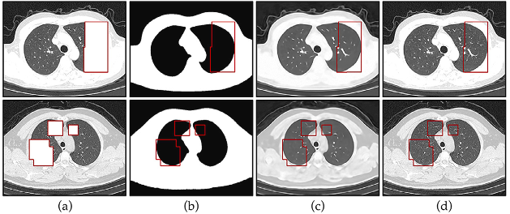

Fig. 1. (a) Input CT images with missing rectangle holes (drawn in red). (b) Structure of CT images recovered from structure inpainting branch of PCIN. (c) Complete results1 from comprehensive inpainting branch of PCIN. (d) Ground truth. (For interpretation of the references to color in this figure legend, the reader is referred to the web version of this article.)

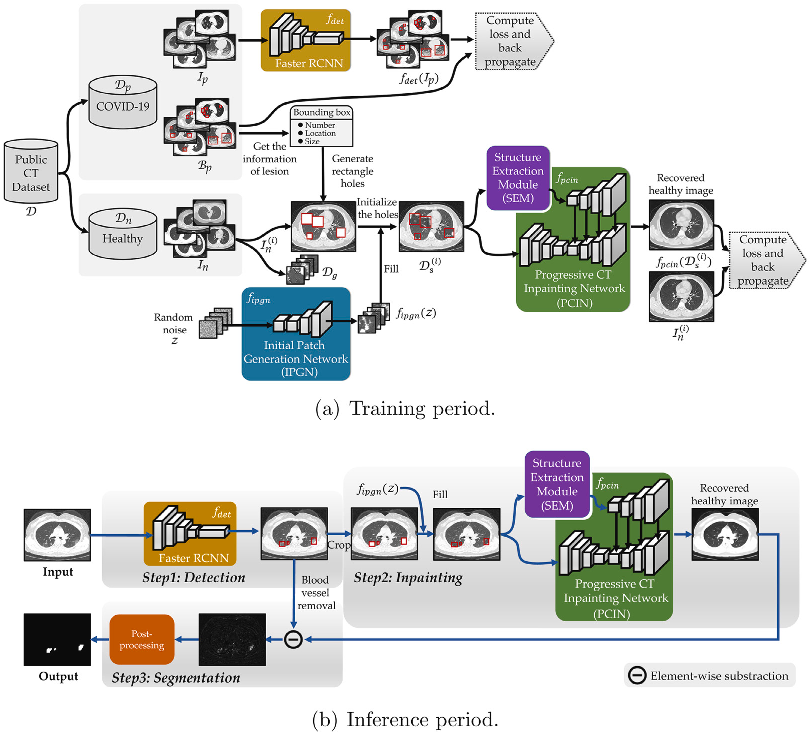

Fig. 2. Workflow of our proposed weakly supervised inpainting-based learning method for COVID-19 lesion segmentation. In the (a) training period, positive samples 𝑝 are used for the training of Faster RCNN. Dataset for PCIN is made by generating rectangle holes on negative images 𝑛 based on real information of the bounding boxes of lesion from 𝑝. Image patches 𝑔 cropped from 𝑛 are utilized to train IPGN. (b) Inference period consists of three stages: detection, inpainting and segmentation.

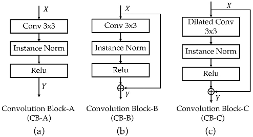

Fig. 5. Convolution blocks used in our proposed IPGN and PCIN. Instance normalization (IN) can accelerate model convergence and promote style consistency between generated images and real images. Transposed convolution layer works well in image reconstruction from reduced representations.

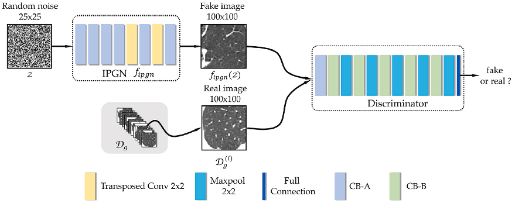

Fig. 6. The structure of initial patch generation network. IPGN generates fake images of 100 × 100 from 2D random noises of 25 × 25. A discriminator is designed and utilized an adversarial loss to train IPGN.

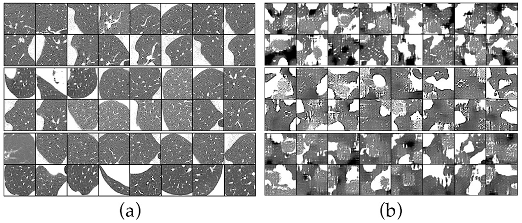

Fig. 7. Comparison between (a) real images and (b) IPGN generated fake images.

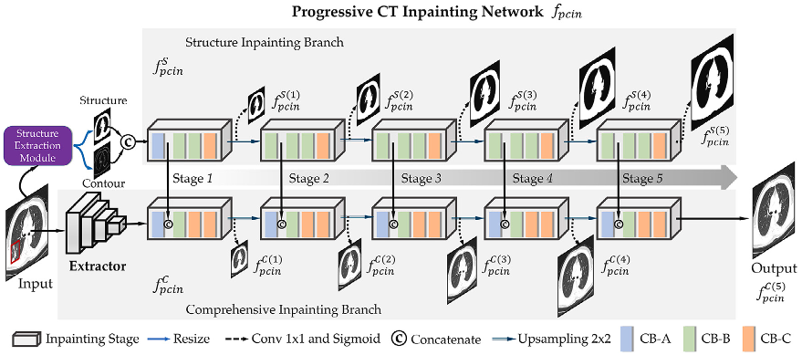

Fig. 8. The structure of progressive CT inpainting network. PCIN decouples the recovery of skeleton from the overall recovery through structure inpainting branch. Deep structure features with different scales extracted from structure inpainting branch are fused to comprehensive inpainting branch for a reasonable result generation.

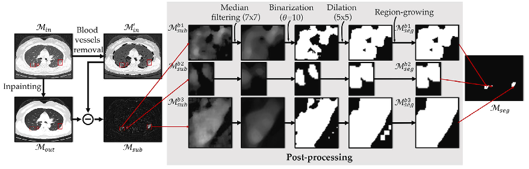

Fig. 9. Details of segmentation, which consists of blood vessels removal, image difference and a series of post-processing steps.

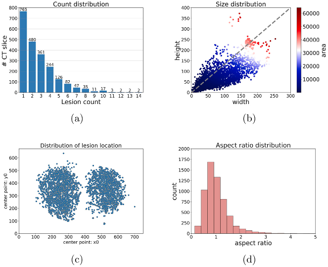

Fig. 10. Statistics of the bounding boxes of lesion in the training set. (a) Count distribution. (b) Size distribution. (c) Distribution of lesion location. (d) Aspect ratio distribution. Zoom in for details.

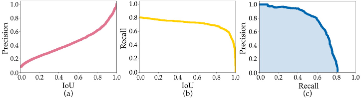

Fig. 11. Performance of Faster RCNN. (a) and (b) are Precision and Recall under different IoU thresholds, respectively. (c) shows the Precision–Recall (PR) curves.

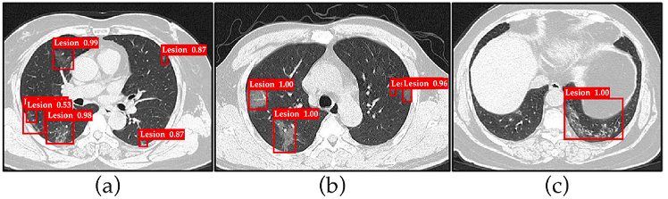

Fig. 12. Visual results of lesion detection using Faster RCNN. The bounding boxes of lesion and their prediction possibilities are shown in red color. (For interpretation of the references to color in this figure legend, the reader is referred to the web version of this article.)

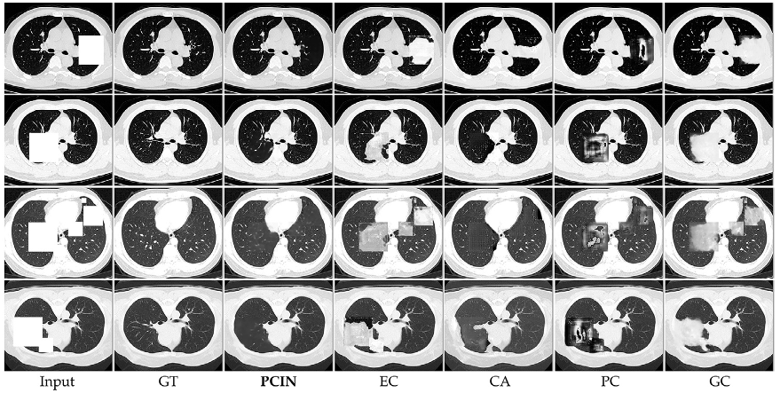

Fig. 13. Visual results of PCIN and four existing methods. GT represents ground truth. PCIN generates most reasonable and realistic content.

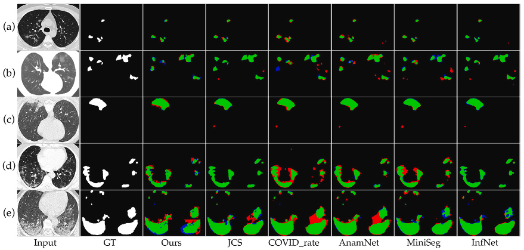

Fig. 14. Visual comparison of lesion segmentation results. GT represents ground truth. The green, blue, and red regions refer to true positive, false negative and false positive pixels, respectively. (For interpretation of the references to color in this figure legend, the reader is referred to the web version of this article.)

| | |
| :--- | :--- |
| Base size Scale | 8 |
| Aspect ratio | (4, 16, 32) (0.5, 1, 1.5) |
|  |  |
| Anchor size (width, height) | (26, 39), (32 32), (45 22), (105 157), (128 128), (181 90), (209 314), (256 256), (362 181) |

Table 1 Initial setting of anchors.

| | | | |
| :--- | :--- | :--- | :--- |
|  | Positive | Negative |  Total |
| Train | 2508 | 1720 | 4228 |
| Test. | 496 | 158 | 654 |
| Total | 3004 | 1878 | 4882 |

Table 2 Details of the public dataset.

| | | | |
| :--- | :--- | :--- | :--- |
| Network | Batch size | Epochs | Learning rate |
| Faster RCNN | 6 | 100 | 1e-5 |
| IPGN | 20 | 100 | 2e-4 |
| PCIN | 2 | 100 | 2e-3 |

Table 3 Detail parameters of training.

| | | | |
| :--- | :--- | :--- | :--- |
| Methods | MAE- | PSNR+ | SSIM+ |
| EC | 81.08 | 7.33 | 0.1224 |
| CA | 49.89 | 12.01 | 0.1784 |
| PC | 63.97 | 10.27 | 0.1101 |
| GC | 93.12 | 7.49 | 0.1263 |
| PCIN(0) | 21.23 | 17.87 | 0.3042 |
| PCIN(127) | 23.63 | 17.58 | 0.3021 |
| PCIN(255) | 24.83 | 17.04 | 0.2889 |
| PCIN(mean) | 23.47 | 17.61 | 0.3032 |
| PCINC fire) | 14.93 | 21.47 | 0.4182 |
| PCIN(*): * represents initial value of missing holes. mean: The mean pixel value of the training set. |

Table 4 Comparison of inpainting performance with different methods.

| | | | | | | | |
| :--- | :--- | :--- | :--- | :--- | :--- | :--- | :--- |
|  | Ratio | 0~2% | 2~4% | 4~6% | 6~8% | 8%~10% | &gt;10% |
| MAE- | EC | 32.51 | 48.05 | 63.74 | 76.55 | 85.24 | 95.17 |
| CA | 19.98 | 39.21 | 61.35 | 81.46 | 103.81 | 122.43 |
| PC | 17.89 | 30.03 | 44.11 | 62.36 | 95.19 | 109.43 |
| GC. | 28.43 | 39.67 | 55.01 | 68.47 | 79.19 | 96.81 |
| PCIN | 7.27 | 7.22 | 7.02 | 7.65 | 6.63 | 6.19 |
| PSNR+ | EC | 13.93 | 10.53 | 9.08 | 8.17 | 7.18 | 6.6 |
| CA | 17.05 | 10.84 | 8.02 | 6.41 | 4.88 | 4.4 |
| PC | 18.31 | 13.37 | 10.67 | 7.93 | 5.29 | 4.31 |
| GC. | 15.14 | 12.05 | 9.42 | 8.38 | 7.21 | 6.29 |
| PCIN | 27.46 | 24.1 | 26.94 | 26.11 | 25.54 | 23.39 |
| SSIM+ | EC | 0.6712 | 0.6043 | 0.4931 | 0.3727 | 0.2643 | 0.1282 |
| CA | 0.5686 | 0.4305 | 0.3423 | 0.2633 | 0.2226 | 0.0418 |
| PC | 0.6914 | 0.6185 | 0.4902 | 0.3731 | 0.2959 | 0.1126 |
| GC. | 0.3551 | 0.4041 | 0.3039 | 0.2966 | 0.3666 | 0.2769 |
| PCIN | 0.6435 | 0.6378 | 0.6528 | 0.6419 | 0.6845 | 0.6634 |

Table 5 Comparison of image inpainting performance for different ratios of missing area.

| | | | |
| :--- | :--- | :--- | :--- |
| Methods | Baseline | #Param | FLOPS |
| UNet | - | 31.04M | 421.49G |
| Attention-UNet | UNet | 34.87M | 513.79G |
| SegNet | VGG | 29.44M | 422.07M |
| JCS | VGG16&amp;Res2net101 | 117.72M | 484.14G |
| coVID-rate | - | 14.38M | 297.92G |
| AnamNet | - | 4.47M | 196.12G |
| Miniseg | - | 0.8M | 1.03G |
| InfNet | - | 31.07M | 57.56G |
| IPGN | GAN | 1.61M | 16.17G |
| PCIN | VGG16 | 25.46M | 236.94G |

Table 6 Comparison of the deep learning models used in this segmentation process in terms of number of training parameters and FLOPs.

| | | | | | |
| :--- | :--- | :--- | :--- | :--- | :--- |
| Label  | Methods | DSC(%) | IoU(%) | SEN(%) | SPE(%) |
| Full | UNet | 77.23 | 70.41 | 77.05 | 99.91 |
| Attention-UNet | 80.22 | 73.81 | 79.18 | 99.91 |
| SegNet | 76.82 | 69.95 | 74.88 | 99.91 |
| Full | JCS | 82.33 | 76.38 | 81.95 | 99.90 |
| COVID-rate | 81.96 | 75.68 | 84.67 | 99.85 |
| AnamNet | 81.62 | 75.08 | 79.95 | 99.92 |
| Miniseg | 81.05 | 74.72 | 80.53 | 99.90 |
| InfNet | 85.88 | 79.93 | 87.01 | 99.89 |
| Bounding Box | GrabCut | 43.87 | 43.42 | 43.61 | 99.83 |
| Ours | 78.34 | 70.82 | 82.95 | 99.75 |

Table 7 Comparison of lesion segmentation performance.

| | | | | |
| :--- | :--- | :--- | :--- | :--- |
| Methods | DSC(%) | IoU(%) | SEN(%) | SPE(%) |
| Fast Marching | 67.20 | 58.82 | 68.29 | 99.51 |
| Navier-Stokes | 67.39 | 58.98 | 68.05 | 99.55 |
| EC | 72.53 | 65.91 | 77.79 | 99.46 |
| CA | 69.89 | 61.68 | 72.08 | 99.49 |
| PC | 68.10 | 59.65 | 69.25 | 99.46 |
| GC | 72.29 | 64.23 | 77.08 | 99.42 |
| PCIN | 74.28 | 68.22 | 73.01 | 99.50 |
| PCIN(Post-Processing) | 78.34 | 70.82 | 78.07 | 99.75 |

Table 8 Comparison of segmentation performance for inpainting networks.

## Reference

[1] H. Swapnarekha, H.S. Behera, J. Nayak, B. Naik, Role of intelligent computing in COVID-19 prognosis: A state-of-the-art review, Chaos Solitons Fractals 138 (2020) 109947.

[2] Y.-Q. Lu, A woman with fever and cough: coronavirus disease 2019, Intern. Emerg. Med. 15 (8) (2020) 1553-1554.

[3] Y. Cao, Z. Xu, J. Feng, C. Jin, X. Han, H. Wu, H. Shi, Longitudinal assessment of COVID-19 using a deep learning-based quantitative CT pipeline: illustration of two cases, Radiology: Cardiothorac. Imaging 2 (2) (2020) e200082.

[4] T. Zheng, M. Oda, C. Wang, T. Moriya, Y. Hayashi, Y. Otake, M. Hashimoto, T. Akashi, M. Mori, H. Takabatake, et al., Unsupervised segmentation of COVID- 19 infected lung clinical CT volumes using image inpainting and representation learning, in: Medical Imaging 2021: Image Processing, Vol. 11596, International Society for Optics and Photonics, 2021, p. 115963F.

[5] J. Chen, L. Wu, J. Zhang, L. Zhang, H. Yu, Deep learning-based model for detecting 2019 novel coronavirus pneumonia on high-resolution computed tomography, Sci. Rep. 10 (1) (2020).

[6] B. Zhou, A. Khosla, A. Lapedriza, A. Oliva, A. Torralba, Learning deep features for discriminative localization, in: 2016 IEEE Conference on Computer Vision and Pattern Recognition, (CVPR), IEEE, 2016, pp. 2921-2929.

[7] C. Rother, V. Kolmogorov, A. Blake, ''GrabCut'' interactive foreground extraction using iterated graph cuts, ACM Trans. Graph. (TOG) 23 (3) (2004) 309-314.

[8] M. Rajchl, M.C. Lee, O. Oktay, K. Kamnitsas, J. Passerat-Palmbach, W. Bai, M. Damodaram, M.A. Rutherford, J.V. Hajnal, B. Kainz, et al., Deepcut: Object seg- mentation from bounding box annotations using convolutional neural networks, IEEE Trans. Med. Imaging 36 (2) (2016) 674-683.

[9] D. Lin, J. Dai, J. Jia, K. He, J. Sun, Scribblesup: Scribble-supervised convolutional networks for semantic segmentation, in: Proceedings of the IEEE Conference on Computer Vision and Pattern Recognition, 2016, pp. 3159-3167.

[10] Z. Ji, Y. Shen, C. Ma, M. Gao, Scribble-based hierarchical weakly supervised learning for brain tumor segmentation, in: International Conference on Medi- cal Image Computing and Computer-Assisted Intervention, Springer, 2019, pp. 175-183.

[11] A. Bearman, O. Russakovsky, V. Ferrari, L. Fei-Fei, What's the point: Semantic segmentation with point supervision, in: European Conference on Computer Vision, Springer, 2016, pp. 549-565.

[12] S. Ren, K. He, R. Girshick, J. Sun, Faster r-cnn: Towards real-time object detection with region proposal networks, Adv. Neural Inf. Process. Syst. 28 (2015).

[13] O. Ronneberger, P. Fischer, T. Brox, U-net: Convolutional networks for biomedical image segmentation, in: International Conference on Medical Image Computing and Computer-Assisted Intervention, Springer, 2015, pp. 234-241.

[14] Z. Zhou, M.M. Rahman Siddiquee, N. Tajbakhsh, J. Liang, Unet++: A nested u- net architecture for medical image segmentation, in: Deep Learning in Medical Image Analysis and Multimodal Learning for Clinical Decision Support, Springer, 2018, pp. 3-11.

[15] F. Milletari, N. Navab, S.-A. Ahmadi, V-net: Fully convolutional neural networks for volumetric medical image segmentation, in: 2016 Fourth International Conference on 3D Vision, (3DV), IEEE, 2016, pp. 565-571.

[16] Q. Yan, B. Wang, D. Gong, C. Luo, W. Zhao, J. Shen, Q. Shi, S. Jin, L. Zhang, Z. You, COVID-19 chest CT image segmentation-a deep convolutional neural network solution, 2020, arXiv preprint arXiv:2004.10987.

[17] G. Wang, X. Liu, C. Li, Z. Xu, J. Ruan, H. Zhu, T. Meng, K. Li, N. Huang, S. Zhang, A noise-robust framework for automatic segmentation of COVID-19 pneumonia lesions from CT images, IEEE Trans. Med. Imaging 39 (8) (2020) 2653-2663.

[18] N. Paluru, A. Dayal, H.B. Jenssen, T. Sakinis, L.R. Cenkeramaddi, J. Prakash, P.K. Yalavarthy, Anam-net: Anamorphic depth embedding-based lightweight CNN for segmentation of anomalies in COVID-19 chest CT images, IEEE Trans. Neural Netw. Learn. Syst. 32 (3) (2021) 932-946.

[19] Y. Qiu, Y. Liu, S. Li, J. Xu, MiniSeg: An extremely minimum network for efficient COVID-19 segmentation, in: Proceedings of the AAAI Conference on Artificial Intelligence, Vol. 35, (6) 2021, pp. 4846-4854.

[20] X. Wang, S. Liu, H. Ma, M.-H. Yang, Weakly-supervised semantic segmentation by iterative affinity learning, Int. J. Comput. Vis. 128 (6) (2020) 1736-1749.

[21] X. Liu, Q. Yuan, Y. Gao, K. He, S. Wang, X. Tang, J. Tang, D. Shen, Weakly supervised segmentation of covid19 infection with scribble annotation on ct images, Pattern Recognit. 122 (2022) 108341.

[22] I. Laradji, P. Rodriguez, O. Manas, K. Lensink, M. Law, L. Kurzman, W. Parker, D. Vazquez, D. Nowrouzezahrai, A weakly supervised consistency-based learning method for covid-19 segmentation in ct images, in: Proceedings of the IEEE/CVF Winter Conference on Applications of Computer Vision, 2021, pp. 2453-2462.

[23] W. Ding, M. Abdel-Basset, H. Hawash, RCTE: A reliable and consistent temporal- ensembling framework for semi-supervised segmentation of COVID-19 lesions, Inf. Sci. 578 (2021) 559-573.

[24] D.-P. Fan, T. Zhou, G.-P. Ji, Y. Zhou, G. Chen, H. Fu, J. Shen, L. Shao, Inf-net: Automatic covid-19 lung infection segmentation from ct images, IEEE Trans. Med. Imaging 39 (8) (2020) 2626-2637.

[25] A. Coates, A.Y. Ng, Learning feature representations with k-means, in: Neural Networks: Tricks of the Trade, Springer, 2012, pp. 561-580.

[26] Q. Yao, L. Xiao, P. Liu, S.K. Zhou, Label-free segmentation of COVID-19 lesions in lung CT, IEEE Trans. Med. Imaging 40 (10) (2021) 2808-2819.

[27] R. Xu, X. Cao, Y. Wang, Y.-W. Chen, X. Ye, L. Lin, W. Zhu, C. Chen, F. Xu, Y. Zhou, et al., Unsupervised detection of pulmonary opacities for computer-aided diagnosis of Covid-19 on CT images, in: 2020 25th International Conference on Pattern Recognition (ICPR), IEEE, 2021, pp. 9007-9014.

[28] F. Lu et al.

[29] Z. Qin, Q. Zeng, Y. Zong, F. Xu, Image inpainting based on deep learning: A review, Displays 69 (2021) 102028.

[30] C. Barnes, E. Shechtman, A. Finkelstein, D.B. Goldman, PatchMatch: A random- ized correspondence algorithm for structural image editing, ACM Trans. Graph. 28 (3) (2009) 24.

[31] J. Sun, L. Yuan, J. Jia, H.-Y. Shum, Image completion with structure propagation, in: ACM SIGGRAPH 2005 Papers, 2005, pp. 861-868.

[32] L.I. Rudin, S. Osher, E. Fatemi, Nonlinear total variation based noise removal algorithms, Physica D: Nonlinear Phenom. 60 (1-4) (1992) 259-268.

[33] R. Lopez, J. Regier, M.I. Jordan, N. Yosef, Information constraints on auto-encoding variational bayes, Adv. Neural Inf. Process. Syst. 31 (2018).

[34] I. Goodfellow, J. Pouget-Abadie, M. Mirza, B. Xu, D. Warde-Farley, S. Ozair, A. Courville, Y. Bengio, Generative adversarial nets in: advances in neural information processing systems (NIPS), Springer, New York, 2014.

[35] D. Pathak, P. Krahenbuhl, J. Donahue, T. Darrell, A.A. Efros, Context encoders: Feature learning by inpainting, in: Proceedings of the IEEE Conference on Computer Vision and Pattern Recognition, 2016, pp. 2536-2544.

[36] S. Iizuka, E. Simo-Serra, H. Ishikawa, Globally and locally consistent image completion, ACM Trans. Graph. (TOG) 36 (4) (2017) 1-14.

[37] G. Liu, F.A. Reda, K.J. Shih, T.-C. Wang, A. Tao, B. Catanzaro, Image inpainting for irregular holes using partial convolutions, in: Proceedings of the European Conference on Computer Vision, (ECCV), 2018, pp. 85-100.

[38] J. Yu, Z. Lin, J. Yang, X. Shen, X. Lu, T.S. Huang, Free-form image inpaint- ing with gated convolution, in: Proceedings of the IEEE/CVF International Conference on Computer Vision, 2019, pp. 4471-4480.

[39] Y. Zeng, J. Fu, H. Chao, B. Guo, Learning pyramid-context encoder network for high-quality image inpainting, in: Proceedings of the IEEE/CVF Conference on Computer Vision and Pattern Recognition, 2019, pp. 1486-1494.

[40] J. Li, F. He, L. Zhang, B. Du, D. Tao, Progressive reconstruction of visual structure for image inpainting, in: Proceedings of the IEEE/CVF International Conference on Computer Vision, 2019, pp. 5962-5971.

[41] K. Nazeri, E. Ng, T. Joseph, F. Qureshi, M. Ebrahimi, EdgeConnect: Structure guided image inpainting using edge prediction, in: 2019 IEEE/CVF International Conference on Computer Vision Workshop, (ICCVW), IEEE, 2019, pp. 3265-3274.

[42] Q. Wang, Y. Chen, N. Zhang, Y. Gu, Medical image inpainting with edge and structure priors, Measurement 185 (2021) 110027.

[43] R. Girshick, Fast r-cnn, in: Proceedings of the IEEE International Conference on Computer Vision, 2015, pp. 1440-1448.

[44] N. Otsu, A threshold selection method from gray-level histograms, IEEE Trans. Syst. Man Cybern. 9 (1) (1979) 62-66.

[45] S. Suzuki, et al., Topological structural analysis of digitized binary images by border following, Comput. Vis., Graph. Image Process. 30 (1) (1985) 32-46.

[46] A.F. Frangi, W.J. Niessen, K.L. Vincken, M.A. Viergever, Multiscale vessel enhancement filtering, in: International Conference on Medical Image Computing and Computer-Assisted Intervention, Springer, 1998, pp. 130-137.

[47] Majun, Gecheng, Y. Wang, X. An, J. Gao, Z. Yu, M. Zhang, Liuxin, X. Deng, S. Cao, COVID-19 CT lung and infection segmentation dataset (verson 1.0) [data set], Zenodo (2020).

[48] S.P. Morozov, A.E. Andreychenko, I.A. Blokhin, P.B. Gelezhe, A.P. Gonchar, A.E. Nikolaev, N.A. Pavlov, V.Y. Chernina, V.A. Gombolevskiy, MosMedData: data set of 1110 chest CT scans performed during the COVID-19 epidemic, Digital Diagn. 1 (1) (2020) 49-59.

[49] Z. Wang, A.C. Bovik, H.R. Sheikh, E.P. Simoncelli, Image quality assessment: from error visibility to structural similarity, IEEE Trans. Image Process. 13 (4) (2004) 600-612.

[50] Y.-H. Wu, S.-H. Gao, J. Mei, J. Xu, D.-P. Fan, R.-G. Zhang, M.-M. Cheng, Jcs: An explainable covid-19 diagnosis system by joint classification and segmentation, IEEE Trans. Image Process. 30 (2021) 3113-3126.

[51] N. Enshaei, A. Oikonomou, M.J. Rafiee, P. Afshar, S. Heidarian, A. Mohammadi, K.N. Plataniotis, F. Naderkhani, COVID-rate: an automated framework for seg- mentation of COVID-19 lesions from chest CT images, Sci. Rep. 12 (1) (2022) 1-18.

[52] Fangfang Lu received the Ph.D. degree in control theory and control engineering from Shanghai Jiaotong University, Shanghai, China, in 2013. She is currently an assistant professor in Shanghai University of Electric Power. Her current research focuses on medical image processing, machine learning, pattern recognition and image quality assessment.

[53] Zhihao Zhang received the B.E. degree in Electronical Information Science and Technology from Nanjing XiaoZhuang University, Nanjing, China in 2018. He is Currently working toward the M.S. degree in artificial intelligence and big data From Shanghai University of Electric Power. His current research focuses on medical image processing, deep learning and defect detection.

[54] Tianxiang Liu received the B.E. degree in Xiamen University Tan Kah Kee College, Zhangzhou, China, in 2020. He is currently working toward the M.S. degree in electronical information computer science and technology from Shanghai University of Electric Power. His current research focuses on medical image processing and deep learning.

[55] Chi Tang received the B.E. degree in mechanical and electronic information process from Nantong Institute of technology, Nantong, China, in 2020. He is currently working toward the M.S. degree in artificial intelligence and big data from Shanghai University of Electric Power. His current research focuses on deep learning and image processing. Hualin Bai received the B.E. degree in Computer Science and Technology from Xuzhou University of Technology, Xuzhou, China, in 2019. He is currently working toward the M.S. degree in artificial intelligence and big data from Shanghai University of Electric Power. His current research focuses on rock reconstruction, deep learning and generative adversarial networks.

[56] Guangtao Zhai received the B.E. and M.E. degrees from Shandong University, Shan- dong, China, in 2001 and 2004, respectively, and the Ph.D. degree from Shanghai Jiao Tong University, Shanghai, China, in 2009. He is currently a Research Professor with the Institute of Image Communication and Information Processing, Shanghai Jiao Tong University. His research interests include multimedia signal processing and perceptual signal processing.

[57] Jingjing Chen received the Ph.D. in Computer Science from Hong Kong Baptist University in 2016. Currently he is a research fellow with the school of Economics of Fudan University. He also serves as research fellow with Fudan-Stanford China Institute for Financial Technology and Security. His research interests include: Blockchain, e-Government and Enterprise Information System.

[58] Xiaoxin Wu received the B.E. degree from ChongQing Medical University, China, in 2013, the Doctoral degree in Zhejiang University, China, in 2019. Currently he is an attending physician in the First Affiliated Hospital, Zhejiang University School of Medicine. His current research focuses on the diagnosis and treatment of emerging infectious diseases.

